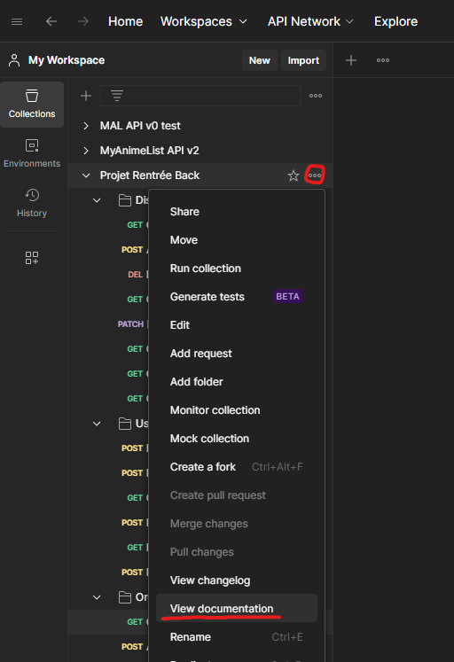

# Projet Rentrée - Back

Vous êtes ici sur le repository de la partie back de notre application.
Il s'agit d'une API Rest basé sur Spring Boot et h2.

## Installation classique

Prerequis : Avoir installé Java 17 et Maven

```console
git clone https://github.com/theoernould/projet-rentree-back
cd projet-rentree-back
mvn clean install
mvn spring-boot:run
```

## Installation avec Docker

Prerequis : Avoir installé Docker sur sa machine

```console
docker build . -t project-rentree-back
docker run -p 8080:8080 -d project-rentree-back
```

## Sources

Le dossier src contient les sources du projet.
Les packages sont :
- **annotation** : contient des annotations personnalisées utilisées notament pour l'authentification
- **controller** : contient les controllers de l'API.
- **config** : contient les classes de configuration de l'API.
- **dto** : contient les objets de transfert de données, triés par entité.
- **exception** : contient des exceptions custom avec des message personnalisées renvoyées par l'API en cas d'erreur côté serveur.
- **filter** : contient les filtres utilisés pour l'authentification, la gestion des CORS et la gestion des erreurs.
- **models** : contient les entités de la base de données.
- **models/enums** : contient les enums utilisés dans les entités.
- **repository** : contient les repositories utilisés pour les entités.
- **services** : contient les services utilisés par les controllers pour gerer les entités.

## Postman

Dans le dossier "resources" se trouve un fichier "Projet Rentrée.postman_collection.json" qui contient une collection Postman avec toutes requêtes utiles pour utiliser l'API.
Pour importer la collection, il suffit de cliquer sur "Import" dans Postman et de sélectionner le fichier json.


## Documentation

La documentation de l'API est accesible directement dans la collection Postman fournie.

